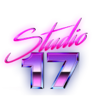
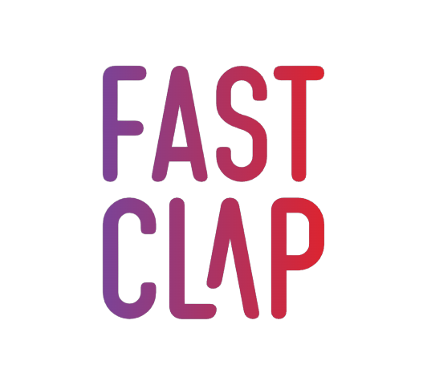
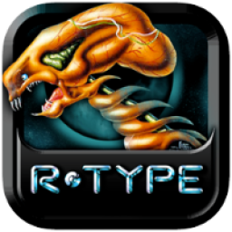

 

# Hi, I'm Clément :speech_balloon:

### I am passionate about managing and executing all types of projects.

- 
 I am a third year student & developer learning at <b><a href="https://www.epitech.eu">Epitech</a></b>  

- 
 I am the Head of the Partnership and Events Department & an IT Project Manager at <b><a href="https://taker.epitech.eu/">Junior Conseil Taker</a></b>  

- 
 Most of my students projects are public in this organisation <b><a href="https://github.com/Studio-17">Studio17</a></b>  

 

### My last projects

- 
 <b><a href="https://github.com/FastClap">Fast Clap</a> :</b> A solution that facilitates the task of film pre-production for assistant directors

- 
 <b><a href="https://github.com/Studio-17/Indie-Studio">Indie Studio</a> :</b> A 3D video game based on the bomberman game

- 
 <b><a href="https://github.com/Studio-17/R-Type">R-Type</a> :</b> A network game which consists of directing a ship to eliminate different types of enemies

- 
 <b><a href="https://github.com/Studio-17/Zappy">Zappy</a> :</b> A network game with several teams confront on a tiles map containing resources

 

## Connect with me:

&nbsp; &nbsp;

&nbsp; &nbsp;

